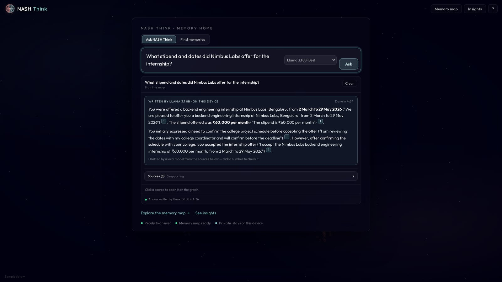
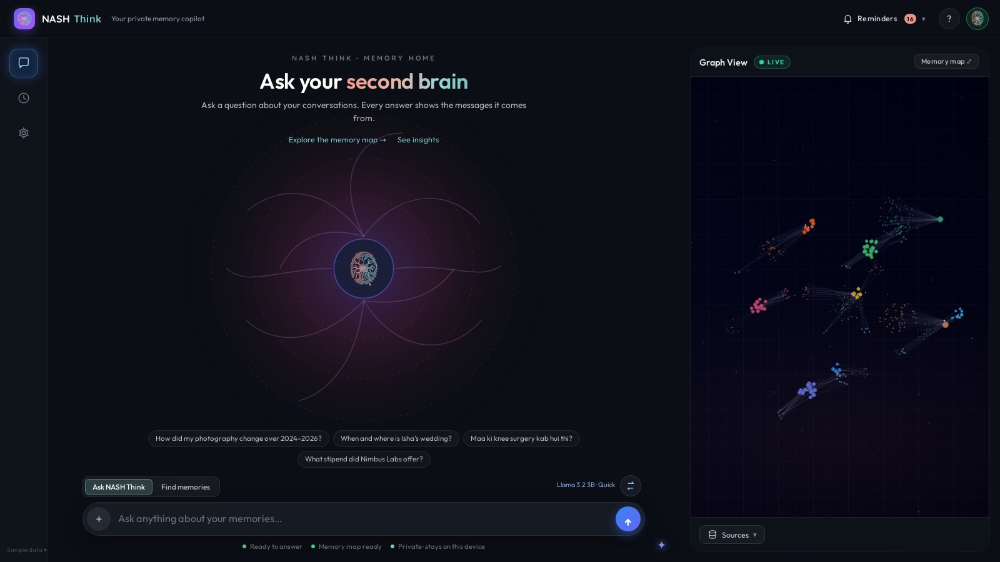
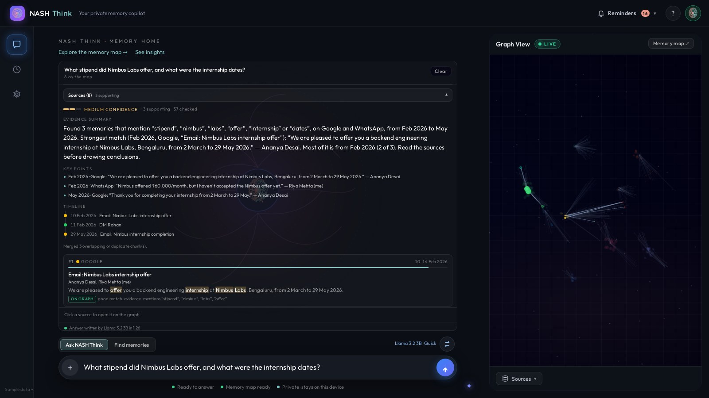
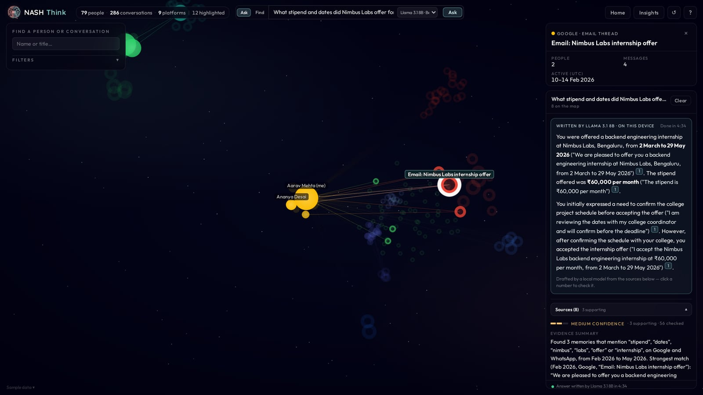
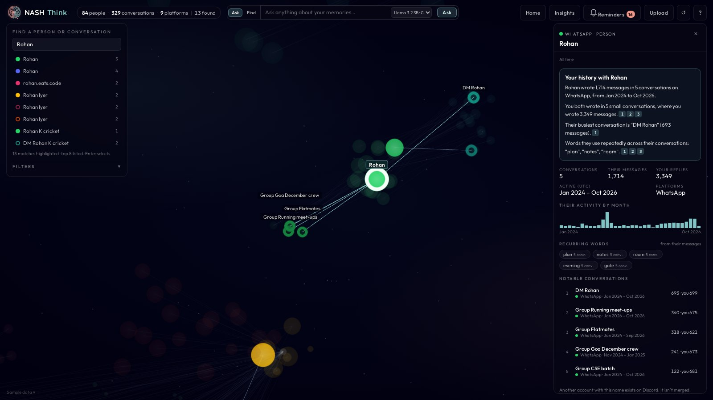
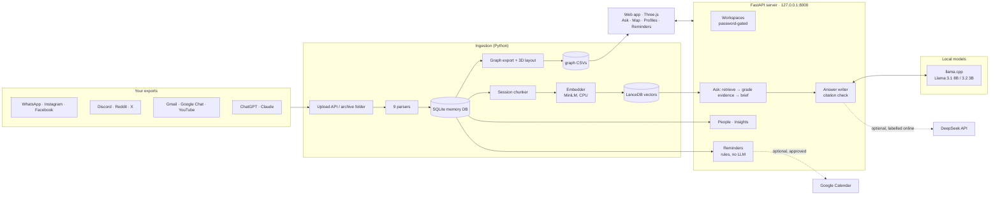
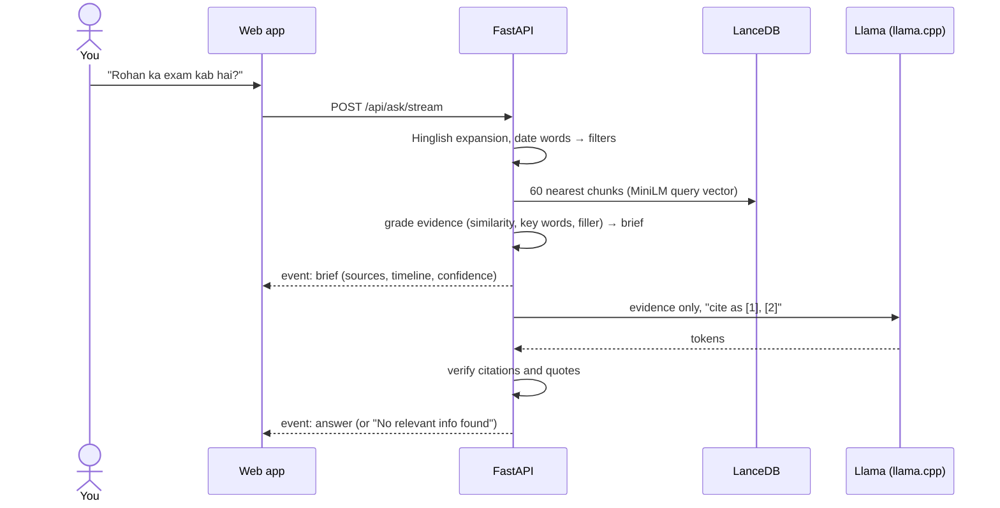

<p align="center"></p>

<h1 align="center">NASH Think</h1>

<p align="center"><b>A sovereign second brain for the life hidden in your conversations.</b><br>
Team NASH (SAI034) · ASYNC'26 · Track 1: Sovereign AI</p>

<p align="center">
  <a href="https://github.com/binarybranch30/nashthink/actions/workflows/tests.yml"></a>
  
  
  
  
  
  <a href="LICENSE"></a>
</p>

<p align="center"><b>🎬 Demo video:</b> <i>YouTube link coming before submission</i> · <b>📘 API:</b> <code>http://127.0.0.1:8000/api/docs</code> (OpenAPI)</p>

---

## Contents

[Overview](#overview) · [Screenshots](#screenshots) · [How it fits Track 1](#how-it-fits-track-1) · [Architecture](#architecture) ·
[Installation](#installation) · [Configuration](#configuration) · [Usage](#usage) ·
[Testing](#testing--quality) · [Benchmarks](#benchmarks--maturity) · [Troubleshooting](#troubleshooting--known-limitations) ·
[Prior work](#prior-work-and-what-we-built-at-async26) · [Security](#security) · [Contributing & license](#contributing--license) · [Team](#team-nash)

## Overview

**The problem.** Your plans, deadlines, promises and memories are scattered across a dozen chat apps. Asking an AI
about them today means handing your most private data to a third-party cloud.

**NASH Think** imports your chat history from **9 platforms** into one memory that runs entirely on your own
machine. Ask in English or Hinglish and get an answer that cites the exact messages. See who you talk to on a 3D
memory map, and get reminders for the plans hidden in your chats, synced to your calendar if you want.

**Who it's for:** anyone whose life happens in chats (students, founders, families), and small teams who want
an assistant over their own knowledge without a cloud provider.

- 🔒 **Private by design:** chats, search index and the language model (Llama via llama.cpp) stay on your device. No cloud, no GPU.
- 📎 **Answers you can check:** every claim cites real messages. Weak evidence gives "No relevant info found", not a guess.
- 🗺️ **One memory across 9 apps:** WhatsApp, Instagram, Facebook, Discord, Reddit, X, Google (Gmail, Chat, YouTube), ChatGPT, Claude.
- 🇮🇳 **Hinglish-aware:** understands chat shorthand and romanised Hindi ("kal 6 baje call karenge").
- ⏰ **Reminders from chats:** plans, deadlines, birthdays and promises, with optional Google Calendar sync.

| Feature | What it does |
|---|---|
| **Ask** | Answers from your chats with numbered citations, confidence, key points and a timeline |
| **Local AI answers** | Llama 3.1 8B (Best) or Llama 3.2 3B (Quick) write the answer on your machine via llama.cpp |
| **Evidence only** | Quotes, counts and dates in ~2 s, with no language model at all |
| **Memory map** | 3D graph of people and conversations, clustered by app; cited sources light up |
| **Person profiles** | Your history with someone: counts, dates, recurring words, notable chats, full message history |
| **Reminders** | Rule-based extraction (English + Hinglish) of plans, deadlines, promises; `.ics`, Google Calendar sync |
| **Upload** | Drag-and-drop chat exports in the browser; platform auto-detection; background ingestion |
| **Insights** | Activity over time, platforms and top contacts |
| **Workspaces** | Demos run on a fictional archive; your real data is behind a password |

## Screenshots

<p align="center"><br>
<sub>Ask: Llama 3.1 8B answers on this device, citing the exact messages</sub></p>

| | |
|---|---|
| <br><sub>Home: one question box above your memory map</sub> | <br><sub>The sources behind every answer, with a timeline</sub> |
| <br><sub>Memory map: the cited conversation and its people light up</sub> | <br><sub>Your history with a person</sub> |

<sub>All screenshots use the fictional sample archive; no real chats are shown.</sub>

## How it fits Track 1

The track asks for a working system that goes **Data → Knowledge → Memory → Reasoning → Action**, locally:

| Stage | NASH Think |
|---|---|
| **1. Data** | Automatic ingestion of user-owned exports from 9 platforms (upload in the browser or drop into `archive/`); incremental, safe to re-run |
| **2. Knowledge** | SQLite knowledge base of people, conversations and messages; graph of who talks to whom; identity map merges your own accounts |
| **3. Memory** | Conversations split into sessions and embedded (multilingual MiniLM, 384-d) into LanceDB: persistent long-term semantic memory |
| **4. Reasoning** | Hybrid retrieval (semantic + keyword + Hinglish expansion), deterministic evidence grading, then an open-weight Llama on llama.cpp writes a cited answer; citations are verified |
| **5. Action** | Reminders found in your chats (plans, deadlines, birthdays, promises) that you mark done, snooze or edit; `.ics` export and automatic Google Calendar sync into a calendar of its own |

Everything runs local-first on a CPU-only machine (tested on 6 vCPU / 11 GB RAM, shared).

## Architecture



**Service boundaries.** One FastAPI process owns the data and the embedding model; the web app is a client of
its HTTP API. llama.cpp runs as a separate local process (`scripts/llm.sh`). Only two optional
paths leave the machine, both off by default: DeepSeek answers (labelled "online") and Google Calendar sync.

### End-to-end: asking a question



**Pipeline in short.**
1. **Parse:** one parser per platform writes people, conversations and messages to SQLite (UTC timestamps, idempotent).
2. **Chunk:** conversations split into sessions at long silences (30 min to 12 h), up to 4,000 tokens each.
3. **Embed:** each chunk becomes a 384-dimension vector with `paraphrase-multilingual-MiniLM-L12-v2` on the CPU, stored in LanceDB.
4. **Find evidence:** the 60 nearest chunks are checked without AI (similar enough, mentions the question's key words, not filler), merged and graded high / medium / low.
5. **Write:** the local model sees only that evidence and must cite it; unsupported answers become "No relevant info found".
6. **Act:** reminders are extracted by rules; you act on them in the app, in a calendar file or in Google Calendar.

**Design docs:** [`docs/project_overview.md`](docs/project_overview.md) · [`docs/local_llm.md`](docs/local_llm.md) ·
[`docs/hinglish.md`](docs/hinglish.md) · [`docs/reminders.md`](docs/reminders.md) · OpenAPI at `/api/docs`.

## Installation

### Prerequisites

| Requirement | Version / size |
|---|---|
| OS | Linux or macOS (Windows via WSL2) |
| Python | **≥ 3.11** (developed on 3.12) |
| RAM | 4 GB for search and Evidence only; **+5.4 GB** for Llama 3.1 8B, **+2.5 GB** for Llama 3.2 3B |
| CPU / GPU | Any x86-64 or ARM CPU; no GPU needed (add `-ngl 99` in `config/llm_profiles.json` if you have one) |
| Disk | ~1 GB for Python packages and the embedding model; 4.9 GB (8B) or 2 GB (3B) per model file |
| Optional | [llama.cpp](https://github.com/ggml-org/llama.cpp) `llama-server` for written answers; Node ≥ 20 + Playwright only for the browser e2e test |

**Stack:** Python · SQLite · sentence-transformers · LanceDB · llama.cpp · Llama 3.1 8B / 3.2 3B (Q4_K_M GGUF) ·
FastAPI · Uvicorn · Three.js

### Step by step

```bash
# 1. Clone and create the environment
git clone https://github.com/binarybranch30/nashthink.git && cd nashthink
python3 -m venv .venv
.venv/bin/pip install torch --index-url https://download.pytorch.org/whl/cpu
.venv/bin/pip install -r requirements.txt

# 2. Say which accounts are yours, so your messages map to "you"
cp config/identity_map.json.example config/identity_map.json    # edit your handles

# 3a. Try it on the fictional sample archive (no personal data needed)
cat demo/README.md          # how to build the sample memory

# 3b. Or import your own exports: open the app and press U (Upload), or put them under archive/:
#   archive/whatsapp/  archive/instagram-*.zip  archive/discord/<name>/  archive/reddit-export/
#   archive/twitter/   archive/google/Takeout/  archive/chatgpt/         archive/claude/
python3 scripts/parsers/whatsapp_parser.py        # repeat per platform: meta_parser (Instagram/Facebook),
                                                  # discord, reddit, twitter, google, chatgpt, claude
python3 scripts/utils/export_cosmograph.py        # graph of people and conversations
python3 scripts/utils/compute_layout.py           # 3D positions
python3 scripts/semantic/chunk_builder.py         # conversation sessions
.venv/bin/python scripts/semantic/embedder.py \
  --input processed_data/semantic/session_chunks.json --topics-only --topics-table topics

# 4. Run
scripts/start_sarthink.sh       # API + web app on http://127.0.0.1:8000/
scripts/status_sarthink.sh      # health, search index, database, local models
scripts/stop_sarthink.sh

# 5. Optional: written answers from a local Llama (see docs/local_llm.md for the model files)
scripts/llm.sh start best       # Llama 3.1 8B on :8083   (or: start quick → Llama 3.2 3B on :8082)
```

The server binds to `127.0.0.1` only. From another computer, tunnel it: `ssh -N -L 8000:127.0.0.1:8000 <user>@<server>`.

## Configuration

### Environment variables

Put secrets in `.env` at the repo root (gitignored; see [`.env.example`](.env.example)). Everything is optional:
without any of them NASH Think runs fully offline.

| Variable | Used by | Type | Default | Required | Description |
|---|---|---|---|---|---|
| `SARTHINK_HOST` | start script | string | `127.0.0.1` | no | Bind address; keep it local |
| `SARTHINK_PORT` | start/stop/status scripts | int | `8000` | no | API and web app port |
| `SARTHINK_LOG` | start script | path | `processed_data/api.log` | no | Server log file |
| `SARTHINK_PIDFILE` | start/stop scripts | path | `processed_data/api.pid` | no | PID file |
| `SARTHINK_LLAMA_PORTS` | status script | list | `8082 8083` | no | Local Llama ports to report |
| `SARTHINK_WORKSPACES` | server | path | `config/workspaces.json` | no | Workspaces config (sample data + password-protected own data) |
| `HF_HUB_OFFLINE` | server, embedder | `0`/`1` | unset | no | `1` = never contact Hugging Face (after the model is cached) |
| `DEEPSEEK_API_KEY` | answer writer | secret | unset | no | Enables the optional online DeepSeek answer styles (labelled "online") |
| `GOOGLE_CLIENT_ID` | calendar sync | string | unset | for Google sync | OAuth client (Desktop app) for reminders → Google Calendar |
| `GOOGLE_CLIENT_SECRET` | calendar sync | secret | unset | for Google sync | Its secret |
| `TWITTER_SOCIALDATA_API_KEY` | `scripts/context/` | secret | unset | no | Fetch missing reply context for X (never used on the sample) |
| `REDDIT_CLIENT_ID`, `REDDIT_CLIENT_SECRET`, `REDDIT_USERNAME`, `REDDIT_PASSWORD`, `REDDIT_USER_AGENT` | `scripts/context/` | strings | unset | no | Fetch missing Reddit context |
| `CEREBRAS_API_KEY` | `scripts/semantic/summarizer.py` | secret | unset | no | Optional legacy summarizer from the original Sarthink |

### Config files (`config/`, copy from the `.example` files)

| File | Purpose |
|---|---|
| `identity_map.json` | Your handles on each platform, so they merge into "you" |
| `workspaces.json` | `{"default": "demo", "workspaces": {...}}`: sample data for everyone, your data behind a PBKDF2 password (`scripts/utils/set_workspace_password.py`). |
| `llm_profiles.json` | Override model paths, threads, context, GPU layers |
| `reminders.json` | Background reminder scan: `{"enabled": true, "interval_min": 15}` |

## Usage

**Web app:** open `http://127.0.0.1:8000/`. Shortcuts: `/` ask · `G` memory map · `I` insights · `R` reminders ·
`U` upload · `?` help.

**API** (interactive docs at `/api/docs`):

```bash
# Evidence-backed answer (no language model; ~2 s)
curl -s localhost:8000/api/ask -H 'Content-Type: application/json' \
  -d '{"question": "Rohan ka exam kab hai?", "date_from": "2026-09-01"}' | jq '.answer, .sources[0].title'

# Semantic search
curl -s localhost:8000/api/search -H 'Content-Type: application/json' -d '{"query": "flat deposit", "limit": 5}'

# Streamed answer written by the local Llama (Server-Sent Events)
curl -N localhost:8000/api/ask/stream -H 'Content-Type: application/json' -d '{"question": "...", "profile": "best"}'

# Reminders found in the chats; a calendar file
curl -s localhost:8000/api/reminders | jq '.counts'
curl -s localhost:8000/api/reminders.ics -o nashthink.ics

```

| Endpoint | Purpose |
|---|---|
| `POST /api/ask`, `POST /api/ask/stream` | Evidence-backed answer (streamed when a model writes it) |
| `POST /api/search` | Semantic search |
| `GET /api/thread/{id}` | Excerpts of one conversation |
| `GET /api/person/{id}` (+ `/conversations`, `/messages`) | Person profile and history |
| `GET /api/insights` | Activity totals, platforms, top contacts |
| `GET/POST /api/reminders`, `POST /api/reminders/{id}`, `GET /api/reminders.ics` | Reminders: list, add, done/snooze/dismiss/edit, calendar file |
| `GET /api/calendar/status`, `POST /api/calendar/google/sync` | Google Calendar sync |
| `POST /api/upload`, `POST /api/ingest/run`, `GET /api/ingest/status` | Upload exports and build the memory in the background |
| `GET /api/workspace`, `POST /api/workspace/unlock\|lock` | Sample data vs your data |
| `GET /api/llm`, `GET /api/health` | Model and server status |

## Testing & quality

```bash
# All unit and API tests (fake models and throwaway data; no archive, index or network needed)
for t in scripts/tests/test_*.py; do .venv/bin/python "$t" || echo "FAILED: $t"; done

# One suite
.venv/bin/python scripts/tests/test_reminders.py

# Lint (what CI runs): syntax errors and undefined names
.venv/bin/pip install ruff && .venv/bin/ruff check scripts --select E9,F63,F7,F82

# Browser end-to-end test of the web app (needs a running server + Playwright; see the file header)
NODE_PATH=/tmp/pw/node_modules node scripts/tests/graph_ui_e2e.mjs http://127.0.0.1:8000/

# Hinglish retrieval evaluation
.venv/bin/python scripts/semantic/eval_hinglish.py
```

CI ([`.github/workflows/tests.yml`](.github/workflows/tests.yml)) runs the lint and all 17 test suites on every push.
Suites cover the parsers, chunking, embedding metadata, search, Hinglish, Ask and the answer writer (citation checks),
people, insights, workspaces (passwords, cookies, lockout), uploads, reminders and Google Calendar (fake transport).

## Benchmarks & maturity

Measured on the fictional sample archive (12,016 messages, 2,638 chunks, 365 graph nodes) on a shared
6 vCPU / 11 GB RAM VPS with no GPU:

| Operation | Latency |
|---|---|
| Ask, Evidence only (retrieve 60 chunks + grade + brief) | **~2.1–2.4 s** |
| Semantic search | ~2.1–2.5 s |
| Insights, person profile (SQLite, read-only) | ~60–70 ms |
| Reminder extraction, whole archive (rules, no LLM) | ~2 s |
| Written answer, Llama 3.2 3B Quick (`-t 2`) | ~1 min (~8 tok/s) |
| Written answer, Llama 3.1 8B Best (`-t 2`) | ~3–4 min (~2.5 tok/s); seconds with a GPU |
| Embedding (MiniLM, CPU) | minutes for thousands of chunks; one-off, incremental after |

**Maturity: Beta.** It runs end to end on real and sample archives, but it is a hackathon build: single user per
workspace, no multi-tenant hardening, and parsers follow each platform's export format as of 2026.

## Troubleshooting & known limitations

| Symptom | Cause | Fix |
|---|---|---|
| "The app server is offline" | Server not running | `scripts/start_sarthink.sh`; check `processed_data/api.log` |
| Search says the index is unavailable | No LanceDB table yet | Run the chunker and embedder (step 3b) |
| First question is slow | The embedding model loads on the first query | Normal; later queries take ~2 s. Set `HF_HUB_OFFLINE=1` once the model is cached |
| Answer style "Best" disabled | llama.cpp not running | `scripts/llm.sh start best` (or `quick`); `scripts/llm.sh status` |
| Llama very slow or killed | Not enough RAM / too many threads on a shared CPU | Use Quick, keep `-t 2`, run one model at a time |
| My messages show as someone else | Handle missing from the identity map | Add it to `config/identity_map.json`, re-run the parsers |
| Google Calendar: 403 `access_denied` | OAuth app in testing mode | Add your Google account as a test user, or publish the app |

**Known limitations and trade-offs**
- AI answers can still be wrong; citations are there so you can check. Evidence grading favours "No relevant info found" over guessing.
- Written answers take minutes on a CPU; Evidence only is the fast path.
- Some exports only contain your side of a conversation (e.g. Discord data packages).
- The same person on different apps is not yet linked automatically (only your own accounts are, via the identity map).
- Reminders are rule-based: fast and private, but they miss unusual phrasings.

## Prior work and what we built at ASYNC'26

As the rules require, here is exactly what existed before the hackathon and what was built during it. The commit
history on GitHub shows every step (dates are IST).

**Before ASYNC'26: the original Sarthink by Sarthak Sidhant (team member), 13 April 2026, commit `3dd58b9` "Humble Beginnings"**
([sarthak-sidhant/sarthink](https://github.com/sarthak-sidhant/sarthink)). About 3,500 lines:
- Parsers for X/Twitter, Reddit, Discord and Meta (Instagram/Facebook) exports into a SQLite database (`database.py`)
- Context fetchers that pull missing replies for X (SocialData API) and Reddit (OAuth)
- Identity map for your own accounts
- Cosmograph export, a 3D layout script, and a first Three.js 3D graph viewer (`sarthink_graph.html`)

That project visualised your social graph. It had no search, no AI answers, no web server and no reminders.

**Building phase with mentors (22–28 Sep, after the idea deck was submitted on 22 Sep)**
- *23 Sep, Sarthak (`fd69952`):* moved the code into `scripts/`; first semantic layer (session chunker, embedder, summarizer); X id fetcher; thread extraction; graph viewer update.
- *26–28 Sep, Naitik (`cfdaf0d` → `13a31c7`):* local multilingual embeddings in LanceDB and semantic search; FastAPI server; Memory Home, Insights and person profiles; Discord data packages and incremental indexing; answers written by a local Llama (8B/3B on llama.cpp) with streaming and citation checks; Hinglish-aware evidence and honest "No relevant info found"; password-protected workspaces; parsers for WhatsApp, Google, ChatGPT and Claude; the rebrand to NASH Think; optional DeepSeek answers; the fictional sample archive for demos; README and screenshots.

**The 24-hour final build on campus (30 Sep – 1 Oct), from `911cd24` onwards**
- Upload chat exports in the browser, with platform detection and background ingestion
- Reminders: rule-based English + Hinglish extraction of plans, deadlines, birthdays and promises; incremental scans; Reminders panel; `.ics` export and subscribe link; automatic Google Calendar sync; browser alerts
- A calmer 3D memory map (one cluster per app, small apps visible, clickable app names) and a three-column Memory Home (rail, chat, Graph View)
- Security fix: a query parameter could skip the workspace password; only the signed cookie picks a workspace now
- CI (GitHub Actions), `requirements.txt`, this README, `SECURITY.md` and `CONTRIBUTING.md`, and an MIT license

**Third-party work we use** (under their own licenses): Llama 3.1 8B and Llama 3.2 3B (Llama Community Licenses),
`paraphrase-multilingual-MiniLM-L12-v2` (Apache 2.0), llama.cpp (MIT), sentence-transformers, LanceDB, FastAPI,
Three.js (MIT). The sample archive in `demo/` is fictional and was written for this project.

## Security

- The server binds to `127.0.0.1`; your archive, database, index, models and `.env` are gitignored and never leave your machine.
- Workspace passwords are stored only as salted PBKDF2 hashes; sessions are signed, HttpOnly, SameSite=Strict cookies with lockout after repeated failures.
- Stores that hold chat lines (reminders) are created owner-only (`0600`).
- The local model only ever sees the evidence for one question.

**Found a vulnerability?** Please don't open a public issue. Follow [`SECURITY.md`](SECURITY.md) to report it privately.

## Contributing & license

Contributions are welcome. See [`CONTRIBUTING.md`](CONTRIBUTING.md) for the workflow, code style and how to run the checks.
Released under the [MIT License](LICENSE).

### Project layout

```text
scripts/parsers/    one parser per platform
scripts/semantic/   chunking, embeddings, search, Hinglish layer, reminder rules
scripts/api/        FastAPI server, Ask, answer writer, profiles, insights, workspaces, reminders, upload
scripts/utils/      database layer, graph export, 3D layout, helpers
scripts/context/    optional: fetch missing reply context for X and Reddit
scripts/tests/      tests with fake models and throwaway data; browser e2e
config/             identity map, LLM profile, workspace and reminder examples
demo/               fictional sample archive
docs/               local LLM setup, Hinglish notes, reminders, project overview
sarthink_graph.html the web app (single file, Three.js)
```

## Team NASH

Built for **ASYNC'26**, Track 1: Sovereign AI (team ID SAI034).

| Name | Role |
|---|---|
| Naitik Srivastava | Team lead |
| Astitva Singh | Member |
| Sarthak Sidhant | Member (author of the original Sarthink) |
| Hemanth Keerthipati | Member |

Contact: naitiksri08@gmail.com
